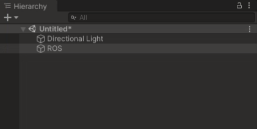
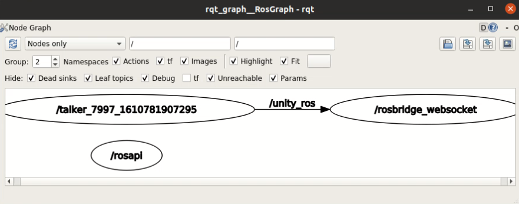
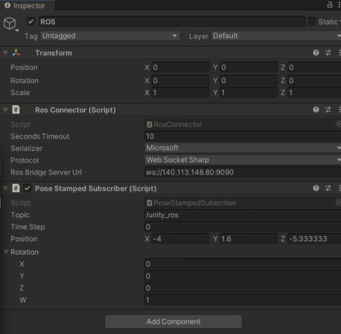
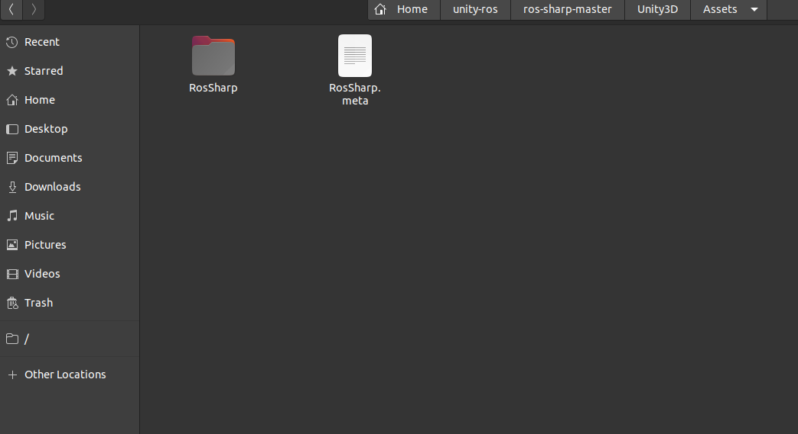

# Unity-ROS 
In this project, I have already packaged unity3d and ros into docker.  
You can open unity directly in docker and communicate with the robot through ros.  
```bash
Ununtu version: 18.04 
Unity version: 2019.4.14
ROS version: melodic
```  
## How to Run    
      
### I. How To Build Docker
Install [Docker](https://docs.docker.com/install/linux/docker-ce/ubuntu/)  

```bash
$ cd unity-ros/Docker
$ source build.sh
```

### II. Run Container
```bash
$ cd unity-ros
$ source docker_run.sh
```  
If you want to join container by another terminal.  
```bash
$ cd unity-ros
$ source docker_join.sh
``` 

### III. Open Unity
Script uses the license to open Unity, then you can select "Unity_Ros_Project" and try to build an environment connected to ros.  

```bash
$ cd unity-ros
$ source start_unity.sh
``` 
### IV. Connect to ROS
Open another terminal and use docker_join.sh to enter the container. 

```bash
$ cd unity-ros
$ source catkin_make.sh
$ source environment.sh
$ roslaunch rosbridge_server rosbridge_websocket.launch
```   
On the left-hand side panel, create a new empty object, and name is to "ROS".  
  
In the "ROS" object, add a component called "RosConnector", which is the connector between Unity and ROS.  
For each of these component, just specify the "Topic", which is the ROS topic name you would like the publisher to publish to.   
You could customize the "Frame Id" based on your requirements.    
  
Open another terminal and use docker_join.sh to enter the container.  
Publish pose to unity.   
```bash
$ cd unity-ros
$ source environment.sh
$ rosrun unity_ros pub_pose.py
```   
  
 
  
  
#### If You Want To Create New Project To Connect ROS
 1. Unzip ros-sharp-master.zip
 2. Drag ros-sharp-master/Unity3D/Assets/RosSharp folder into the Unity project's Asset folder:  
 


## Authorize Unity
There are two files "Unity_v2019.x.ulf" and "Unity_v2020.x.ulf" in the repo.
These two files are two versions of unity license.